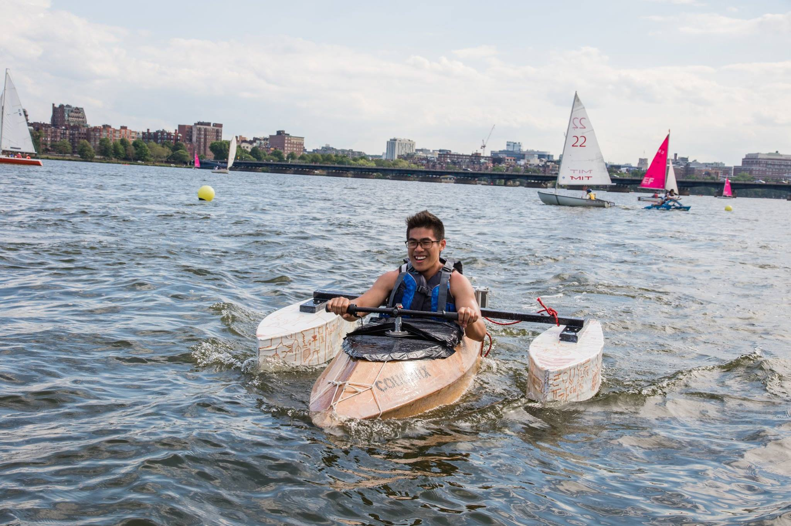
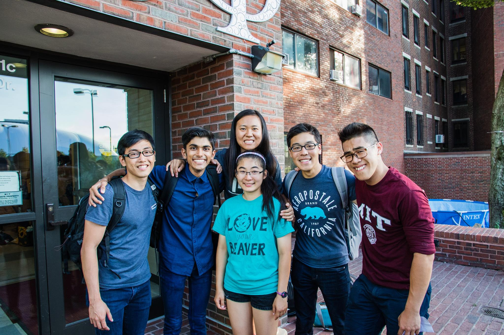

# Electric Powered Boat Project

In the summer of 2016, a team of fellow engineers and I worked on building a manned, electric powered boat. The boat was designed, fabricated and driven by our team, under the super vision of staff members working at the [MIT-IDC](https://innovation.mit.edu/resource/international-design-center/). In designing the boat, we utilized software such as [SolidWorks](https://www.solidworks.com/) and [Rhinoceros](https://www.rhino3d.com/) as 3D modelling tools, which we could then use as engineering references for fabrication. I was tasked with building the mechanical drivetrain, which along with the streamline design of the boat, propelled us to number 1 in a little race amongst other boat builders. 

 
(3D model of the final drivetrain design.)  

## The Electric Boat

The design and build processes were tiring but extremely enjoyable, lasting a duration of approximately 8 weeks. However, we finally succeeded in finishing its construction, where it very smoothly rode the gentle waves of the Charles river in Cambridge, Massachusetts.

 
(Photo of me in the electric boat on the Charles river. Photo by Chan Wei Ren.)

## Team Cougar

The team, which dawned the
name "Cougar", consisted of 6 individuals (in photo below), all of whom were rising sophomores at the time. 

 
(Photo of team Cougar. Photo by Chan Wei Ren.)

The team members were (from left to right): Tze Chong, Shalv, Zou, Casey, Wei Ren and myself.  
