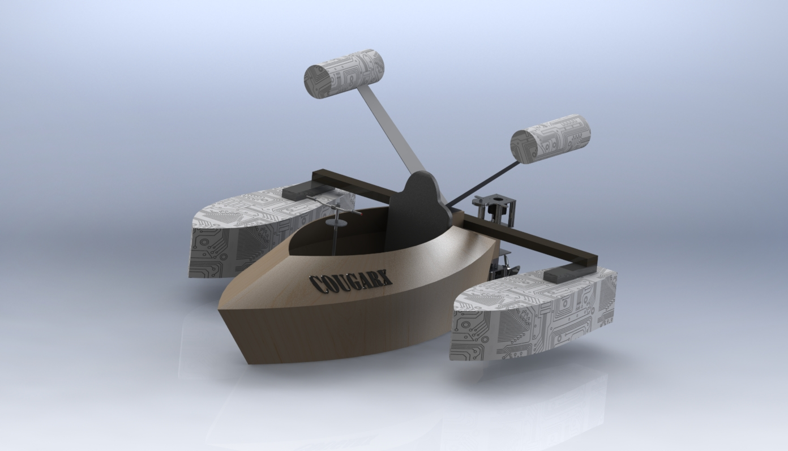
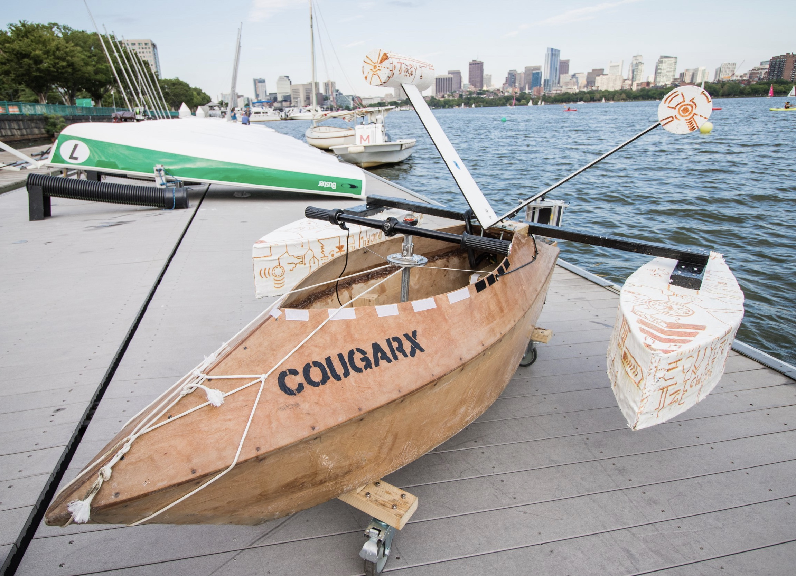

# Electric Powered Boat Project

In the summer of 2016, a team of fellow engineers and I worked on building a manned, electric powered boat. The boat was designed, fabricated and driven by our team, under the super vision of staff members working at the [MIT-IDC](https://innovation.mit.edu/resource/international-design-center/). In designing the boat, we utilized software such as [*SolidWorks*](https://www.solidworks.com/) and [*Rhinoceros*](https://www.rhino3d.com/) as 3D modelling tools, which we could then use as engineering references for fabrication. I was tasked with building the mechanical drivetrain, which along with the streamline design of the boat, sturdy steering mechanism and robust electronics, propelled us to number 1 in a little race amongst other boat builders. 

## 3D Models

A big part leading to the success of this project was ensuring that every piece of the boat-puzzle fit together. It was critical that this be guaranteed during the design phase, so that fabrication and testing could be done with minimal do overs. To this end, our team went through numerous and rapid iteration cycles with the use of computer aided design (CAD) tools. Below are some of the final CAD designs for the boat.  

### Final Drivetrain Design (CAD)

The image below shows the final CAD model of the drivetrain mechanism, designed in SolidWorks. My summer baby.

                
(My 3D model of the final drivetrain design. Made with SolidWorks.)  

### Final Boat Design (CAD)

The image below shows the final CAD model of our electric boat rendered in SolidWorks. 

                
(My 3D model of the final boat design. Made with SolidWorks.)  

## The Electric Boat

I must say that the final build of the boat did not turn out too far off from our final CAD model (image below).

 
(Photo of the electric boat by the Charles river. Photo by Chan Wei Ren.)

The design and build processes were tiring but nonetheless enjoyable, lasting a duration of approximately 8 weeks. We eventually succeeded in finishing its construction, where it smoothly rode the gentle waves of the Charles river in Cambridge, Massachusetts (GIF of Cougar member Shalv taking the boat for a ride below).

 
(Video taken by Casey.)

Of course, I myself could not resist taking the boat we worked so hard on for a spin in the Charles (image below).

 
(Photo of me in the electric boat on the Charles river. Photo by Chan Wei Ren.)

## Team Cougar

The team, which dawned the name "*Cougar*", consisted of 6 individuals (in photo below), all of whom were rising sophomores at the time. 

 
(Photo of team Cougar. Photo by Chan Wei Ren.)

The team members were (from left to right): Tze Chong, Shalv, Zou, Casey, Wei Ren and myself.  
