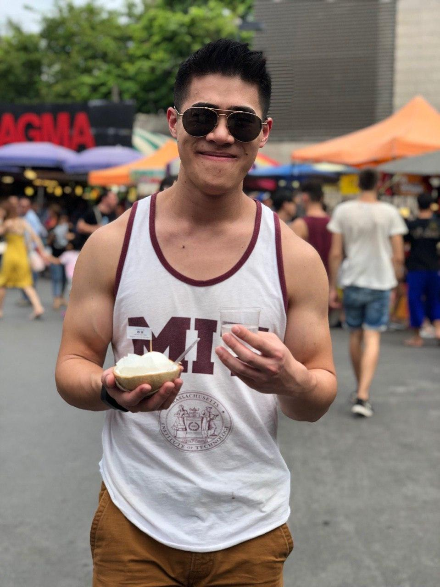

# Welcome! 

You have found yourself in the personal website of Reuben Wang. Nice to meet you, fellow internet dweller!

# Biography (the short version)

 \

I was born and raised in the tropical island of Singapore. Always having had a keen curiosity of the world led me to deeply appreciate music, art and the natural sciences. The last of which eventually pushed me to pursue a formal education in STEM, where I studied engineering (at [SUTD](https://www.sutd.edu.sg/)) and physics (at [MIT](http://www.mit.edu/)) as an undergraduate. Over the course of my educational life, physics has grown to be a true passion of mine. This brings me to where I am now, pursing a PhD in theoretical physics at the [University of Colordao, Boulder](https://www.colorado.edu/). 

# Research Interests

I am currently working in the [Bohn group](http://grizzly.colorado.edu/) at [JILA](https://jila.colorado.edu/). My area of research falls under the field of *atomic, molecular and optical* (**AMO**) physics, particularly studying many-body physics and thermodynamics of ultracold gases (i.e. I like to study the behavior of systems with many things when they are very cold). Below is a (hopefully growing) list of my publications. Enjoy! 

## Publications

* [R. R. W. Wang, B. Xing, G. G. Carlo, and D. Poletti, **"Period Doubling in Period-One Steady States"**, Physical Review E (2018).](https://journals.aps.org/pre/abstract/10.1103/PhysRevE.97.020202)

# Academic Notes

Throughout my arduous academic escapades, I have managed to transcribe notes from several of these classes to LaTex. Below is an assortment of the few I have managed. 

# Other Projects and Interests

* [Praxis+, "Phosphene", Singapore Night Festival 2017](https://www.youth.sg/Users/P/R/PraxisPlus/2017/8/The-story-behind-Phosphene) 
