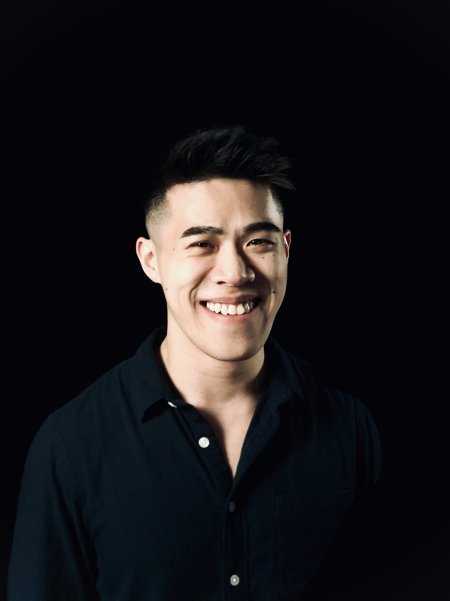

# [Welcome!](https://reubenwangrongwen.github.io/)

You have found yourself in the personal website of Reuben Wang. Nice to meet you, fellow internet dweller!

# Biography

 
 
                   

(photo of me, circa 2020. Photo credits: [Aditya Manikashetti](https://www.splitsecond.sg/).)

I was born and raised in the tropical island of [Singapore](https://www.visitsingapore.com/en/). My formal academic pursuits have been in STEM, where I studied engineering (at [SUTD](https://www.sutd.edu.sg/)) and physics (at [MIT](http://www.mit.edu/)) as an undergraduate. I received my doctorate in theoretical physics at [JILA](https://jila.colorado.edu/), a joint institute between [CU, Boulder](https://www.colorado.edu/) and [NIST](https://www.nist.gov/) ([Curriculum Vitae](./CV2024.pdf)). 
<!---
[Here's](./whyPhD.md) a little write up of why a PhD for those interested.
--> 

# Physics Research

I am currently working in the [Bohn group](http://grizzly.colorado.edu/) at [JILA](https://jila.colorado.edu/). My area of research falls under the field of *atomic, molecular and optical* (**AMO**) physics, particularly studying *many-body physics* and the *collective dynamics of ultracold dipolar gases* (i.e. I like to study the behavior of systems with many things when they are very cold). Below is a (hopefully growing) list of my publications. Enjoy! 

# Publications

A list of my publications with short digests about them can be found [here](./Publications/pubs.md). My *Google scholar* can be found [here](https://scholar.google.com/citations?user=Lsw_2DgAAAAJ&hl=en&authuser=1).

# Projects

* [**Music single**, Love (feat. Tim G & Alexis Lee)](https://distrokid.com/hyperfollow/reubenw/love-feat-tim-g--alexis-lee)
* [A collection of my **academic notes** taken in *LaTeX* (ongoing).](./AcademicNotes/AcademicNotes.md)
* [**AI Pick-and-Place Robotic System**, (2019)](./RoboticPicking/RoboticPicking.md)
* ["**The Quantum World**" Workshop, IAP (2019)](./TQW/TQW.md)
* [Praxis+, "**Phosphene**", Singapore Night Festival (2017)](https://www.facebook.com/sutdsingapore/posts/phosphene-by-praxis-get-ready-to-be-mesmerised-by-the-glitters-and-sparkles-in-t/10155450328715977/)
* [**Electric Powered Boat**, summer project (2016)](./ElectricBoat/ElectricBoat.md)

# Contact

* Email: <reuben.wang@colorado.edu>
* Office: [JILA](https://jila.colorado.edu/) S370.
