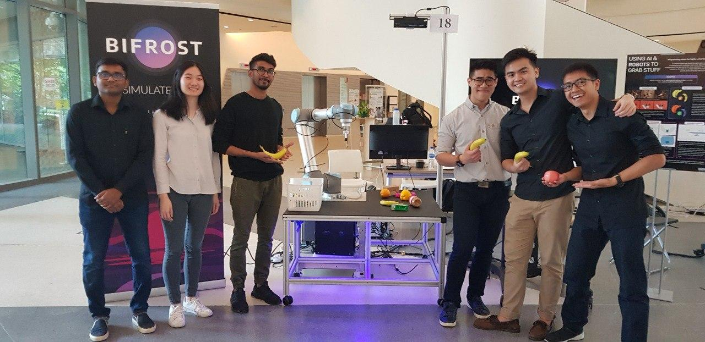

# Autonomous Pick-and-Place Robot

Over the course of about 9 months, a team of friends and I embarked on building an AI-robotic system that could perform general 
pick-and-place tasks. The final system was the integration of a 6-axis robotic arm from [Universal Robots](https://www.universal-robots.com/), a vision system consisting of digital and depth cameras, and an AI program that ran on an external processor. Our system was able to:

* identify and categorize objects when placed on a pre-defined palette;
* ascertain the optimal picking confguration and trajectory to move the object into a pre-defined bin.

A unique feature of this system is that the AI was trained on a synthetic data set. That is, all training data was virtually generated and computer rendered, to provide the AI with photorealistic images to learn from. With this developed technology, my teammates Charles and Aravind have founded the start-up [Bifrost](https://www.bifrost.ai/), that offers AI companies a synthetic data platform to generate their desired data sets. 

## The Team

Our team consisted of a mix of engineering and computer science majors (team picture below). 

               
(From left to right: Keshigeyan Chandrasegaran, Judith Lim, Aravind Kandiah, myself, Charles Wong and Canneth Ho.) 

