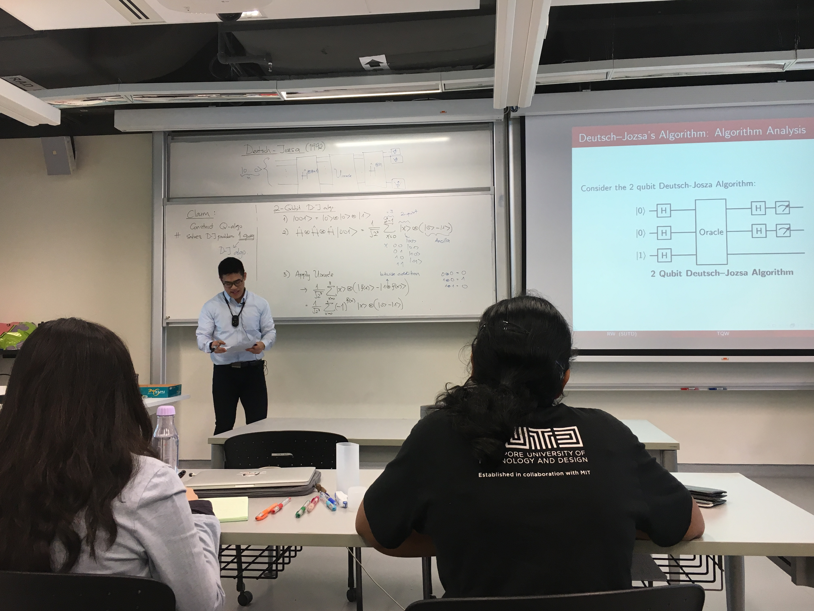
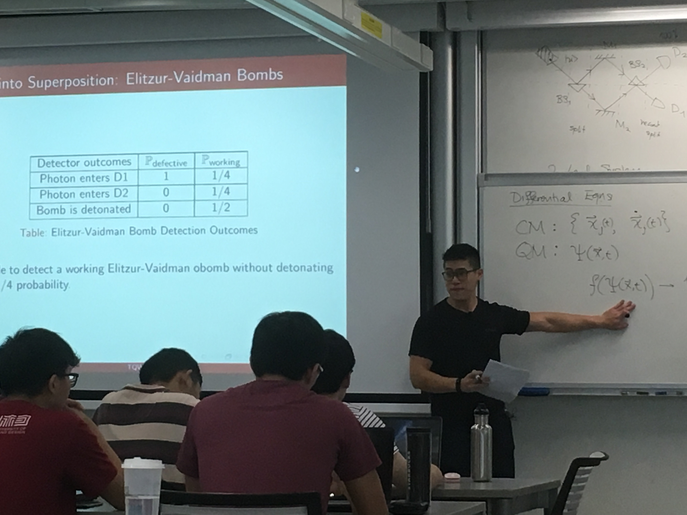
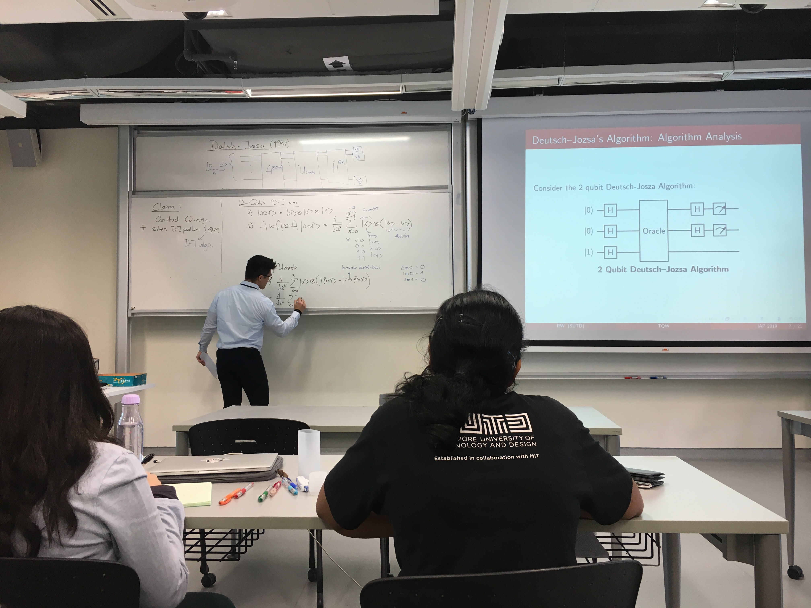

# The Quantum World

*The Quantum World* was a workshop I devised and held, that taught introductory concepts on quantum mechanics and quantum computation in the spring of 2019. The workshop was targeted at engineering students at SUTD with no prior knowledge of quantum theory and was designed to be brief but rigorous. It spanned a total of 4, 2 hour long sessions, for which not all the intended material was covered. This webpage is a catalog of the notes (a short handbook) and slides I made and used to conduct the workshop. 

## The Handbook

[The Quantum World.pdf](./The%20Quantum%20World%20(IAP%202019).pdf)

**Preface from the handbook**:
*This handbook is designed as a brief but mathematically rigorous introduction to quantum science and technology for the tech enthusiast. The materials covered in this handbook are intended to be taught/learned over the course of 2 to 4 weeks with no prior knowledge of quantum physics required. In order to appeal to both scientists and engineers, there will be several topics covered with applications as quantum technologies in sufficient but not comprehensive depth so as to gain literacy of the subject matter. Specifically, we will be exploring a simplified model of radioactive decay in ionization smoke detectors and the model of quantum computation. As a means for appealing to a diverse audience and trying to incorporate the best of both worlds, I have divided the handbook into 2 parent parts. These are namely “understanding the substrate” and “applied abstractions”. This partitioning is to differentiate between content that focuses on quantum theory topics pertaining to describing physical systems vs material that cares only about abstracted utilizable properties (analogous to the distinction between electrical engineering and computer science).*

*Some prerequisites to understanding the material in this book would be knowledge of 1) linear algebra 2) ordinary differential equations 3) classical mechanics 4) basic electrodynamics 5) basic probability theory. I will also occasionally mention relevant words and topics of study that will not be expounded on in this book. This is intentional and meant to encourage the reader to go beyond the contents presented here. Be sure that this will not impede the reader’s understanding of this book. If you are indeed new to quantum mechanics and learning it from scratch, I would suggest attempting the given proofs, derivations and worked examples yourself as practice before looking up the solutions to ensure mastery of the content. This handbook is organized sequentially and no additional resources are required to understand the material outside the prerequisites. If you are unsure of certain concepts presented in this book, it would be useful to take a look at the appendices. There, I have written up additional notes and elaborations on things I found may be useful to the reader. If at the end of this handbook you still feel bewildered by the perplexity that is quantum mechanics, rest in the comfort that even the best minds have struggled with attaining a true grasp of this aspect of reality.*

*"If quantum mechanics hasn’t profoundly shocked you, you haven’t understood it yet." – Niels Bohr*

*Despite this, I am convinced that Quantum mechanics is indeed a beautiful theory of our universe, and I hope this book expresses that to you as much as it does me.*

## Slides

Below are the slides I used for each session of the workshop. These slides were made to aid the in-class lectures conducted by yours truly.

* [Session 1 slides.](TQW%20Day%201.pdf)
* [Session 2 slides.](TQW%20Day%202.pdf)
* [Session 3 slides.](TQW%20Day%203.pdf)
* [Session 4 slides.](TQW%20Day%204.pdf)

## Candid Captures

Some candid photos from the workshop.

  

  

     
